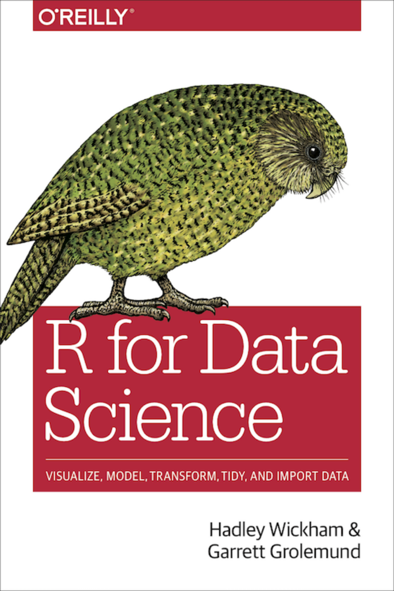

# Julia for Data Science

## Tippie Graduate Analytics Workshop, University of Iowa

### January 11, 2020

# Looks like Python, feels like Lisp, runs like C

This workshop is based in part on material from [R for Data Science](https://r4ds.had.co.nz/) by Hadley Wickham and Garret Grolemund.

